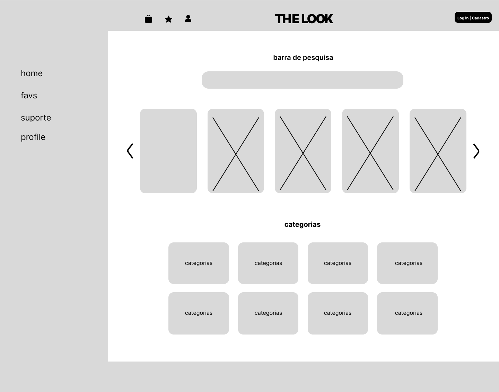
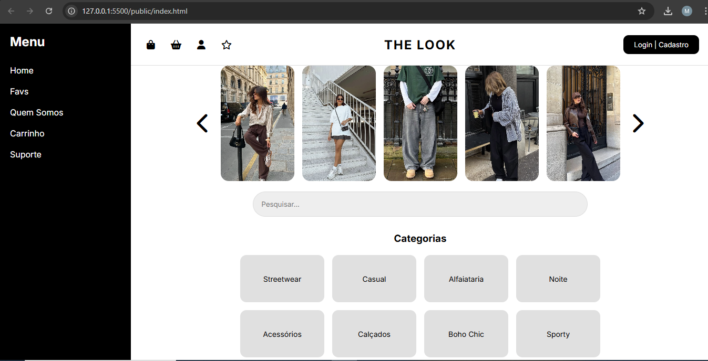
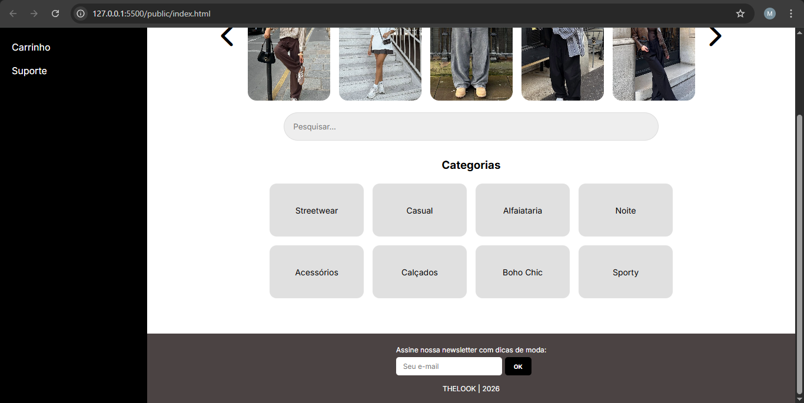

---

## Identificação
* **Nome:** Maria Fernanda Melo e Reis
* **Matrícula:** 919094
* **Proposta do projeto:** Coleções e Itens - Objeto / Item do acervo Galeria e obras, álbuns e faixas, exposições e peças
* **Descrição do projeto:**  O projeto é uma ferramenta de auxílio ao styling que mapeia as roupas e acessórios usados por artistas e ícones da moda. Com o objetivo de oferecer dicas de estilo e facilitar a compra de produtos similares aos utilizados por influenciadores e especialistas da área.

---

## Wireframe

---

## Print Homepage

---
